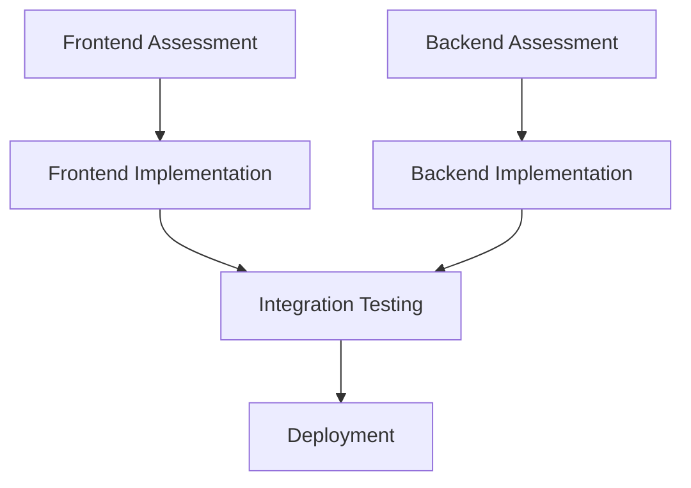

# Task File I/O Documentation Template

Add this section to all droid documentation files (both assessment and action).

---

## Task File Integration

### For Assessment Droids

#### Output Format
**Creates**: `/tasks/tasks-[prd-id]-[domain].md`

**Structure**:
```markdown
# [Domain] Assessment - [Brief Description]

**Assessment Date**: YYYY-MM-DD
**Priority**: P0 (Critical) | P1 (High) | P2 (Medium) | P3 (Low)
**Status**: Assessment Complete

## Executive Summary
[Brief overview of findings]

## Relevant Files
- `path/to/file1.ts` - [Purpose/Issue description]
- `path/to/file2.tsx` - [Purpose/Issue description]
- `path/to/file3.ts` - [Purpose/Issue description]

## Tasks

### 1.0 [Category Name]
- [ ] 1.1 [Specific task description]
  - **File**: `path/to/file.ts`
  - **Priority**: P0
  - **Issue**: [Detailed description of problem]
  - **Impact**: [User/system impact]
  - **Suggested Fix**: [Recommended approach]
  
- [ ] 1.2 [Another specific task]
  - **File**: `path/to/another-file.ts`
  - **Priority**: P1
  - **Issue**: [Problem description]
  - **Impact**: [Impact description]
  - **Suggested Fix**: [Fix approach]

### 2.0 [Another Category]
- [ ] 2.1 [Task description]
  - **File**: `path/to/file.ts`
  - **Priority**: P2
  - **Issue**: [Description]
  - **Impact**: [Impact]
  - **Suggested Fix**: [Fix]

## Findings Details

### [Category 1]
[Detailed analysis with code examples, metrics, and recommendations]

### [Category 2]
[Detailed analysis with code examples, metrics, and recommendations]

## Recommendations
1. [High-level recommendation]
2. [Another recommendation]
3. [Additional recommendation]

## Metrics
- [Relevant metric]: [Value]
- [Another metric]: [Value]
- [Performance indicator]: [Value]
```

**Priority Levels**:
- **P0 (Critical)**: Security vulnerabilities, system-breaking bugs, data loss risks
- **P1 (High)**: Major bugs, significant performance issues, user-facing problems
- **P2 (Medium)**: Minor bugs, code quality issues, optimization opportunities
- **P3 (Low)**: Nice-to-have improvements, minor refactoring, documentation

---

### For Action Droids

#### Input Format
**Reads**: `/tasks/tasks-[prd-id]-[domain].md`

**Expected Structure**:
```markdown
## Tasks
- [ ] 1.1 [Task description]
  - **File**: `path/to/file.ts`
  - **Priority**: P0
  - **Issue**: [Problem]
  - **Suggested Fix**: [Approach]
```

#### Output Format
**Updates**: Same file with status markers and progress notes

**Status Markers**:
- `[ ]` - **Pending**: Not started
- `[~]` - **In Progress**: Currently working on this task
- `[x]` - **Completed**: Successfully finished
- `[!]` - **Blocked**: Cannot proceed (requires attention)
- `[cancelled]` - **Cancelled**: No longer relevant

**Updated Structure**:
```markdown
## Tasks

### 1.0 [Category Name]
- [x] 1.1 [Specific task description]
  - **File**: `path/to/file.ts`
  - **Priority**: P0
  - **Issue**: [Original problem description]
  - **Status**: ✅ Completed
  - **Started**: 2025-01-12 10:30
  - **Completed**: 2025-01-12 11:45
  - **Implementation**: [Description of fix applied]
  - **Changes**:
    - Added input validation for user data
    - Implemented error handling with try-catch
    - Added unit tests for edge cases
  - **Tests**: ✅ All tests passing (12/12)
  - **Validation**: ✅ Biome check passed, no type errors
  
- [~] 1.2 [Another specific task]
  - **File**: `path/to/another-file.ts`
  - **Priority**: P1
  - **Issue**: [Problem description]
  - **Status**: 🔄 In Progress
  - **Started**: 2025-01-12 11:50
  - **Progress**: 60% complete
  - **Current Step**: Writing unit tests
  - **Notes**: Main implementation complete, testing edge cases

- [!] 1.3 [Blocked task]
  - **File**: `path/to/blocked-file.ts`
  - **Priority**: P1
  - **Issue**: [Problem description]
  - **Status**: ⚠️ Blocked
  - **Started**: 2025-01-12 12:00
  - **Blocker**: Missing API credentials for external service
  - **Action Required**: User needs to provide API key
  - **GitHub Issue**: #123 (created for tracking)

### 2.0 [Another Category]
- [ ] 2.1 [Task description]
  - **File**: `path/to/file.ts`
  - **Priority**: P2
  - **Status**: 📋 Pending
  - **Next**: Will start after 1.3 is unblocked
```

**Progress Tracking Guidelines**:
1. **Mark `[~]` immediately** when starting a task
2. **Add timestamps** for started/completed times
3. **Document implementation** details and approach
4. **Include test results** to verify fixes
5. **Update regularly** for long-running tasks
6. **Mark `[x]` only when** fully tested and validated
7. **Use `[!]` for blockers** and create GitHub issues
8. **Add metrics** before/after for performance fixes

---

### For Orchestration Droids

#### Input Format
**Reads**: Multiple task files across domains
- `/tasks/tasks-[prd]-frontend.md`
- `/tasks/tasks-[prd]-backend.md`
- `/tasks/tasks-[prd]-security.md`
- `/tasks/tasks-[prd]-performance.md`

#### Output Format
**Creates**: Master coordination file
- `/tasks/tasks-[prd]-orchestration.md`

**Structure**:
```markdown
# Project [PRD-ID] Orchestration

**Created**: 2025-01-12
**Status**: In Progress

## Overview
[High-level project description]

## Phase Tracking

### Phase 1: Assessment (Completed)
- [x] Frontend assessment → tasks-001-frontend.md
- [x] Backend assessment → tasks-001-backend.md
- [x] Security assessment → tasks-001-security.md

### Phase 2: Implementation (In Progress)
- [~] Frontend fixes → Assigned to frontend-engineer-droid-forge
- [~] Backend fixes → Assigned to backend-engineer-droid-forge
- [ ] Security fixes → Pending (blocked on Phase 2 completion)

### Phase 3: Validation (Pending)
- [ ] Integration testing
- [ ] Performance testing
- [ ] Security audit

## Task Dependencies


## Delegation Log
| Timestamp | Droid | Task File | Status |
|-----------|-------|-----------|--------|
| 2025-01-12 09:00 | frontend-assessment | tasks-001-frontend.md | ✅ Complete |
| 2025-01-12 10:00 | backend-assessment | tasks-001-backend.md | ✅ Complete |
| 2025-01-12 11:00 | frontend-engineer | tasks-001-frontend.md | 🔄 In Progress |
| 2025-01-12 11:30 | backend-engineer | tasks-001-backend.md | 🔄 In Progress |

## Progress Summary
- **Total Tasks**: 47
- **Completed**: 12 (26%)
- **In Progress**: 8 (17%)
- **Blocked**: 2 (4%)
- **Pending**: 25 (53%)

## Blockers
1. Issue #123: Missing API credentials (blocks security-fix tasks)
2. Issue #124: Database migration pending (blocks backend performance tasks)
```

---

## Task File Naming Conventions

**Assessment Outputs**:
- `tasks-[prd-id]-[domain]-assessment.md`
- Example: `tasks-0042-security-assessment.md`

**Action Progress**:
- `tasks-[prd-id]-[domain].md` (updates in place)
- Example: `tasks-0042-security.md`

**Orchestration**:
- `tasks-[prd-id]-orchestration.md`
- Example: `tasks-0042-orchestration.md`

**Domain Names**:
- `frontend` - React/UI components
- `backend` - API/server code
- `security` - Security issues
- `performance` - Performance optimization
- `database` - Database/ORM issues
- `testing` - Test coverage/quality
- `typescript` - Type safety issues
- `auth` - Authentication/authorization
- `caching` - Cache strategy
- `deployment` - CI/CD/infrastructure

---

## Example Workflow

**1. Assessment Droid Creates Task File**:
```bash
/tasks/tasks-0042-security-assessment.md
```

**2. Action Droid Reads and Updates**:
```bash
# Read task file
Read /tasks/tasks-0042-security-assessment.md

# Update status markers as work progresses
- [~] 1.1 Fix SQL injection vulnerability
- [x] 1.2 Add input validation
- [!] 1.3 Update auth tokens (blocked: needs config)
```

**3. Orchestrator Monitors All Task Files**:
```bash
# Check all task files for overall progress
Read /tasks/tasks-0042-security-assessment.md
Read /tasks/tasks-0042-frontend-assessment.md
Read /tasks/tasks-0042-backend-assessment.md

# Update orchestration file with status
Create /tasks/tasks-0042-orchestration.md
```

This creates a clear, traceable workflow where each droid knows exactly what to read and write.
